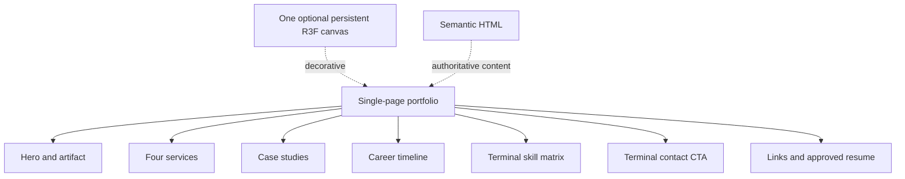

# Embedded Systems Portfolio & Technical Consultancy Website

- **Author:** [Author]
- **Date:** 2026-09-12
- **Status:** Draft
- **Workspace:** `/home/miniblues/projects/github-portfolio`
- **Design-only boundary:** This document specifies the site; it does not implement website code.

## Overview

Build a static GitHub Pages portfolio for Kamal Pandey, an Embedded Software & Systems Engineer. The experience uses an original dark editorial language, restrained glass surfaces, procedural WebGL, and scroll-led storytelling inspired only by publicly visible interaction patterns at Lusion. It must not copy Lusion code, assets, text, brand identity, or proprietary implementation.

The site uses React 19, Vite, TypeScript, Tailwind CSS, custom CSS variables, Three.js through React Three Fiber/Drei, `@react-three/postprocessing`, Lenis, GSAP/ScrollTrigger, and lucide-react. Semantic HTML is authoritative; WebGL, inertia, magnetic cursor, and post-processing are enhancements. Every section remains usable without WebGL, JavaScript scene chunks, smooth scrolling, touch hover, analytics, or a booking service.

## Background & Motivation

The supplied resume describes almost nine years of embedded Linux and systems work: Qualcomm QCM, TI AM66x/AM437x, NXP i.MX8, and Xilinx ZynqMP; board bring-up, Yocto, drivers, OTA, secure boot, IPC, video pipelines, and low-level debugging. It lists SYMX.AI, Vestel International, Dozee, Capgemini, and IFM Engineering. The portfolio converts this evidence into a consultation-oriented narrative without inventing metrics.

Source inspection verified:

- `/home/miniblues/projects/career-ai/README.md`: a Rust CLI/daemon/plugin for discovery, matching, tailoring, rendering, and guarded application submission; SQLite, MCP, and a pipeline state machine are documented.
- `/home/miniblues/projects/fleet-management/README.md`: Rust agent/API/dashboard components, migrations, telemetry, evidence, and distributed-agent documentation. Its docs explicitly distinguish implemented behavior from planned deployment.
- `/home/miniblues/git-repos/grok-build/README.md`: a Rust terminal AI coding agent with TUI, headless mode, ACP, tools, workspace, and documented crate boundaries.

### Repository and commit evidence map

This private evidence map is the authoritative association for historical claims. It is not copied into public output. Public content may reference only an approved opaque evidence ID and approved claim text.

| Evidence ID | Repository path | Commit | Commit date | Subject / fact boundary | Evidence status |
|---|---|---|---|---|---|
| `fleet-9ab8927` | `/home/miniblues/projects/fleet-management` | `9ab8927` | 2026-09-08 | `feat(d14): omp/grok adapters and efficient task execution`; supports the local adapter implementation claim | Local history verified; publication approval required |
| `harness-3586d49e` | `/home/miniblues/git-repos/grok-build` | `3586d49e` | 2026-09-12 | `feat: add /pm slash command and canonical task AST`; supports the local task-management feature claim | Local history verified; public identity restricted |
| `harness-2e267322` | `/home/miniblues/git-repos/grok-build` | `2e267322` | 2026-09-12 | `feat: PR9 rollout controls, observability, benchmarks, recovery`; supports the local reliability/observability feature claim | Local history verified; public identity restricted |

These facts do not establish public ownership, public availability, or client approval. The personal agent harness case study must use the public identity contract below and is omitted unless its publication record is approved.

## Goals & Non-Goals

### Goals

1. Make “Embedded Systems, Linux BSP & Low-Level Architecture” immediately legible.
2. Present four services, an expandable career timeline, three to five evidence-backed case studies, a terminal-style skill matrix, and a contact CTA.
3. Provide cinematic but optional motion: persistent R3F canvas, capped DPR, pointer spring, glass/metal artifact, Lenis/GSAP synchronization, and magnetic cursor.
4. Make all claims, metrics, repositories, links, and media auditable before publication.
5. Ship a relative-path, reproducible GitHub Pages build that works under a repository subpath.

### Non-Goals

- No backend, CMS, database, authentication, form processor, analytics SDK, third-party booking widget, or server-side rendering in v1.
- No fabricated client, scale, reliability, speed, revenue, or latency claims.
- No runtime GitHub API, remote script, iframe, social feed, or required video.
- No publication of local paths, private infrastructure, credentials, unapproved client details, or the prohibited upstream repository name.

## Proposed Design

### Information architecture



A compact sticky navigation links to sections. The hero contains the exact requested headline, a grounded value proposition, and **Explore Projects**, **View Services**, and **Book a Consultation** actions. The booking action is rendered only for an approved real URL; otherwise it becomes an email-based “Start a conversation” action.

### Public-safe personal agent harness identity contract

The case-study identity is a publication contract, not a copywriting convention:

- The only permitted public title, slug prefix, description, Open Graph title/description, page title, JSON-LD name, diagram label, image alt text, link label, accessibility name, and generated source note is **“personal agent harness.”** A public slug may be `personal-agent-harness`.
- The prohibited upstream/product repository term is forbidden as a case-study name, visible text, metadata, URL label, alt text, diagram text, filename, JSON key, source note, or generated HTML/JSON value. The local evidence map may retain opaque repository IDs and private paths outside `dist/`.
- **V1 source-link policy:** the personal agent harness renders no source link, repository link, commit link, or source URL. Its public case-study record may contain only opaque evidence IDs; those IDs are not URLs and are not rendered. The sanitized manifest also contains no source URL for this case study. A future source link requires a new approved policy decision and must still pass the prohibited-identifier scan.
- `npm run validate:publication` scans generated `dist/` HTML, JSON, manifests, filenames, and text assets for the prohibited term, local absolute paths, credential-like strings, and unapproved URLs; any match fails the build. A case-insensitive normalized scan also catches punctuation, case, and URL-encoding variants. It scans anchor `href` values independently, so a prohibited term hidden only in an href fails too.
- The public content registry contains only `publicIdentity`, approved claim text, and opaque evidence IDs. Repository names, remotes, hashes, commit messages, and source URLs stay out of rendered inputs. They may be recorded only in a sanitized committed evidence manifest under the rules below or in protected operator evidence outside the public build.

### Reproducible sanitized evidence manifest

CI needs an auditable mapping from public claims to approval state without receiving local paths or private evidence. Commit `evidence/manifest.v1.json` as a non-sensitive, reviewable manifest. It contains only `manifestVersion`, `registryVersion`, opaque `evidenceId` values, SHA-256 hashes of the exact approved public claim text, `approvalState`, `publicationState`, `sourceKind`, approval/review dates, and canonical/link metadata for links that are actually allowed to render. For the personal agent harness, `sourceKind` is `local-history`, `publicationState` is `claim-only`, and no URL metadata is permitted.

The manifest must not contain local paths, repository names, remote URLs, prohibited identifiers, commit messages, raw source excerpts, client/private claims, credentials, or unapproved link targets. A schema and sanitizer test rejects those fields and scans serialized content, including keys and values. The public registry declares the same `registryVersion`; the validator fails closed if the registry and manifest versions differ, if an evidence ID is absent, duplicated, or unknown, if a claim hash does not match the normalized approved claim text, or if an approval/publication state is not allowed by the case-study record. The build reads only the committed manifest and approved registry; protected operator evidence is used to create and review a manifest update, never fetched nondeterministically by CI. Manifest changes require normal code review and a publication-owner approval recorded in the manifest.

Required negative fixtures include a local path, repository name, commit message, prohibited identifier in a manifest key/value, private claim text, unknown evidence ID, registry-version mismatch, claim-hash mismatch, pending approval, and a prohibited identifier appearing only in an anchor `href`.

### Services

1. **Firmware & Board Bring-Up** — U-Boot, kernel, device tree, drivers, UART/JTAG diagnosis.
2. **Embedded Linux & BSP Development** — Yocto images, root filesystems, power management, secure boot.
3. **Hardware-in-the-Loop & System Verification** — repeatable fixtures, telemetry/evidence, integration and fault validation. This is a proposed service framing, not a claim of a named engagement.
4. **Systems Software & Architecture** — IPC, OTA/SOTA, fleet/runtime boundaries, and performance/reliability design.

### Career timeline

`CareerTimeline` uses typed entries with `period`, `title`, `organization`, `summary`, `accomplishments`, `technologies`, and approved evidence IDs. Resume-backed entries are SYMX.AI (Jan 2025–Present), Vestel (Dec 2022–Jul 2024), Dozee (Jul–Dec 2022), Capgemini (Oct 2020–Jun 2022), and IFM Engineering (Jul 2017–Mar 2020). The resume’s specific claims—OSTree atomic updates, Qualcomm QCM2290 optimization, TI AM665x/AM437x EV charger HMI, NXP BSP work, V4L2/GStreamer, and Open-AMP/RPMSG—remain resume-attributed, not independently measured.

### Case studies and approval records

The launch target is four studies; a fifth is optional only after an approved record exists. The renderer consumes **only** `publication-records/*.json`, never arbitrary README text or repository traversal. Each record contains:

```json
{
  "slug": "fleet-runtime",
  "publicTitle": "Distributed fleet runtime",
  "approvedClaims": [{"text": "...", "evidenceIds": ["fleet-readme-01"]}],
  "excludedClaims": ["client names", "private topology", "planned features presented as shipped"],
  "approvedCommitOrTag": "commit-sha-or-null",
  "clientApproval": {"status": "not-applicable|pending|approved", "recordId": "..."},
  "publicationApproval": {"owner": "name-or-role", "date": "YYYY-MM-DD", "status": "approved|omitted"},
  "redactionReview": {"reviewer": "name-or-role", "date": "YYYY-MM-DD", "status": "passed|failed"},
  "links": [{"label": "...", "url": "https://...", "finalUrl": "https://...", "verifiedOn": "YYYY-MM-DD"}]
}
```

A missing, pending, failed, or omitted record removes the study entirely; it does not render placeholder copy. Every study has context, constraints, an architecture Mermaid diagram, solution, verified results, limitations, evidence IDs, and approved links. Results use `label`, `value`, `source wording`, and verification status. Metrics such as 99.9% are shown only as “resume-reported” where the resume states them.

Planned study candidates:

- **Industrial edge deployment:** resume evidence for QCM2290 tuning, watchdog/power-aware state management, OSTree/SOTA, and debugging. The 99.9% figure is resume-reported only.
- **Distributed fleet runtime:** local Fleet README/docs for agent/API/dashboard boundaries, typed worker protocol, workspace guards, telemetry/evidence, and clearly marked planned inference work.
- **Personal agent harness:** local evidence for TUI/headless/ACP lifecycle, task AST, adapter work, rollout controls, observability, benchmarks, and recovery. Public copy uses only the identity contract above and makes no ownership/availability claim.
- **Career automation pipeline:** local README/source for adapters, matching, tailoring, rendering, dry-run submission gate, SQLite, MCP, and daemon. Its public URL is provisional pending exact verification.

### Terminal skill matrix and contact

`SkillMatrix` is an accessible disclosure/list styled as a terminal. Categories are Languages, OS/platforms, Protocols/hardware, and Tooling. Resume-backed values include C, C++, Python, Bash, Qt/QML; Qualcomm/TI/NXP/Xilinx platforms; CAN/J1939, HaLow Wi-Fi, MQTT, WebRTC, RTSP/RTP, TCP/IP; and JTAG, UART, ftrace, Valgrind, GDB, oscilloscopes, logic analyzers, Yocto, OSTree, Jenkins, GitLab, and Docker.

Contact uses user-triggered static links: email from the resume, GitHub `https://github.com/justdoGIT`, and the LinkedIn profile URL derived from the resume identifier, subject to final URL verification. No phone number is displayed by default. External links use consistent `target="_blank" rel="noreferrer"` only when new-tab behavior is intentionally chosen, with accessible labels that state the destination; same-tab links omit both attributes.

## Runtime, Motion, and Performance

### Chunk graph and persistent canvas

The intended chunk graph is:

```text
index.html + CSS + app-shell/content chunk
  └─ scene-entry chunk (dynamic import after HTML is usable and capability checks pass)
       ├─ R3F/Three/Drei chunk (shared scene vendor chunk)
       └─ postprocessing chunk (dynamic import only for quality tier that enables it)
```

No runtime Mermaid package is needed: diagrams are authored as build-time-safe React/SVG components or sanitized static Mermaid output. The canvas mounts once in `AppShell`, is `aria-hidden="true"`, and never carries information absent from HTML. It pauses when hidden/offscreen and uses reusable objects with no per-frame allocations.

### Dependency matrix and ownership

Dependencies are exact lockfile pins, not floating ranges. PR 1 records the selected versions and Node/npm runtime in `package.json`, lockfile, and `docs/dependency-matrix.json`; CI runs `npm ci` and rejects lockfile drift. The matrix must include React 19 + matching `@types/react`, Vite, TypeScript, Tailwind/PostCSS, Three + matching R3F/Drei peer versions, postprocessing + R3F adapter, Lenis, GSAP, lucide-react, Vitest/Testing Library, axe, Playwright, and Lighthouse. PR 1 must install the matrix and pass a production build; any update requires a matrix diff, peer-dependency check, and targeted scene/accessibility tests. The scene owner owns the dynamic import boundary; the motion owner owns Lenis/GSAP integration; no component may import scene vendors from the initial shell.

### Canvas and adaptive quality

Use `dpr={[1, 1.5]}` on capable desktop, DPR 1 on mobile/low-end, and `MeshPhysicalMaterial` with a `MeshStandardMaterial` fallback. Adaptive quality uses one reproducible frame-time contract rather than mixing inverse units.

**Measurement contract:** the scene is tested in production mode at a fixed 1440x900 desktop viewport or 390x844 mobile viewport, with the hero artifact visible and the same deterministic pointer/scroll script. Each run has a 10-second warm-up, followed by a fixed 20-second sample. The harness records every rendered frame's interval using `requestAnimationFrame`; median FPS is `1000 / median(frameIntervalMs)` and p95 frame time is the 95th percentile of frame intervals in milliseconds. Run five samples per device/browser/profile after discarding the warm-up. Report each run, then aggregate the five run medians using the median; aggregate p95 frame time using the median of run-level p95 values. Do not pool frames across runs.

The release thresholds use the same units: capable desktop enhanced mode passes when aggregate median FPS is at least 55 FPS **and** aggregate p95 frame time is at most 22.2 ms (the p95 guard corresponds approximately to 45 FPS); mobile/low-end mode passes when aggregate median FPS is at least 30 FPS and aggregate p95 frame time is at most 33.3 ms. The reference browser/device profiles are desktop Chrome on the named Intel i5/8 GB reference machine and Android Chrome on the named mobile profile; Safari is reported separately and cannot be silently substituted. A run fails if either threshold fails, and a profile fails if any required run is invalid or the aggregate fails.

The runtime degradation sampler uses the same units over a rolling 2-second decision window after warm-up: if median FPS falls below 40 FPS or p95 frame time exceeds 25.0 ms for two consecutive windows, reduce postprocessing quality one tier; if median FPS falls below 30 FPS or p95 frame time exceeds 33.3 ms for two consecutive windows, disable postprocessing and set DPR to 1. Recovery requires three consecutive 2-second windows at or above 50 FPS and p95 frame time at or below 20.0 ms, then restores at most one tier. The policy is monotonic within a tier and records profile, browser, sample duration, warm-up, thresholds, action, and reason. WebGL failure, failed scene chunk, reduced motion, or unsupported capability selects CSS fallback without affecting content.

### Scroll, reduced motion, and runtime changes

Enhanced mode: Lenis is the sole smooth-scroll owner; one GSAP ticker calls `lenis.raf(time * 1000)`, and `ScrollTrigger.update()` is driven from that same clock. No second scroll interpolator is allowed. `gsap.context()` and Lenis listeners are cleaned up.

Native mode is mandatory when `prefers-reduced-motion: reduce` is true. Lenis and ScrollTrigger-driven effects are not initialized. Scroll-linked scene motion, parallax, magnetic cursor, autoplay, and inertia are disabled; CSS transitions are either removed or immediate. A `MediaQueryList` listener tears down enhanced mode and restores native scrolling when the preference changes at runtime, and initializes enhanced mode only when it changes back and capability checks permit. A future user motion setting uses the same state machine. Keyboard focus, hash navigation, and browser scroll restoration must work in both modes.

### Motion alternatives and minimum experience

| Stack | Cost/complexity | Reduced-motion/touch | Failure mode | Decision |
|---|---|---|---|---|
| Native scroll + CSS/IntersectionObserver | Lowest bundle and debugging cost; limited continuous choreography | Best default; native touch | Less cinematic | Required fallback and acceptable baseline |
| Lenis alone | Moderate dependency; smooth scroll but no timeline orchestration | Must be disabled in reduced motion; good touch fallback | Scroll ownership bugs | Not sufficient for requested section choreography |
| GSAP + Lenis + R3F + postprocessing | Highest bundle, lifecycle, and GPU complexity | Explicit capability state required | Chunk, ticker, peer, or GPU failure | Enhanced desktop mode only |
| CSS/WAAPI + R3F without GSAP | Lower runtime dependency cost | Straightforward fallback | More custom scroll mapping | Revisit if measured stack cost exceeds budget |

If any enhanced dependency fails, the minimum shippable experience is native scrolling, CSS hover/focus states, IntersectionObserver reveal with no essential content gating, static diagrams, and the CSS artifact fallback.

## Provisional Performance Budgets and Device Matrix

These are **pre-implementation targets**, to be measured in PR 4 and revised only through an explicit decision record; they are not current measurements:

| Budget | Provisional pass target |
|---|---:|
| HTML + critical CSS + shell JS transfer (compressed) | <= 150 KB |
| Scene JS + Three/R3F/Drei transfer (compressed) | <= 350 KB, lazy |
| Postprocessing transfer | <= 80 KB, lazy and optional |
| Repository-controlled raster/font/video assets | <= 500 KB; no video in v1 |
| Content visible without scene chunk | <= 1.5 s on emulated Fast 3G |
| Shell interactive without scene | <= 3 s on emulated Fast 3G |
| Canvas initialization on reference desktop | <= 500 ms after shell interactive |
| Desktop enhanced mode | Aggregate median FPS >= 55 and aggregate p95 frame time <= 22.2 ms |
| Mobile/low-end mode | Aggregate median FPS >= 30 and aggregate p95 frame time <= 33.3 ms; postprocessing disabled |

Measurement uses Lighthouse/Playwright on a production build, WebPageTest or equivalent network throttling, browser performance marks around shell and canvas initialization, and a two-second rolling FPS sampler. Reference matrix: desktop Chrome on a 2020-or-newer Intel i5/8 GB machine at 1440p; mid-range Android Chrome on a 2021-or-newer device at 390px viewport; low-end Android emulation (4x CPU slowdown, 512 MB constrained profile); iPhone Safari representative current device; and WebGL-disabled desktop. Test Fast 3G and offline cached shell. PR 4 records actual baselines; a budget change requires owner, reason, before/after data, and approval.

## API / Interface Changes

There is no network API. Internal contracts separate evidence identity, approval, and publication:

```ts
export type Evidence = {
  id: string; kind: 'resume' | 'local-repo' | 'github' | 'inspiration';
  locator: string; accessedOn: string; sourceHash?: string;
  evidenceStatus: 'verified' | 'local-only' | 'unverified' | 'inspiration-only';
  reviewerApproval: 'approved' | 'pending' | 'rejected';
};

export type Claim = {
  text: string; evidenceIds: string[];
  publicationStatus: 'approved' | 'omitted';
  metricLabel?: 'resume-reported' | 'measured' | 'not-a-metric';
};
```

The strict validator fails when a public claim has no approved evidence, an unverified/local-only source appears visibly or as a public link, a metric lacks exact source wording and an explicit label, a link lacks final URL/status/date matching its allowlist, a publication record lacks approval/redaction data, or generated output contains prohibited terms, local paths, secrets, or unsupported placeholders. Negative fixtures must cover: missing evidence, rejected approval, stale link, redirect to wrong repository, mixed-status claim, malformed URL, metric without label, local path, credential-like token, prohibited term variant, omitted case study accidentally rendered, and unapproved external resource.

## Data Model and Publication Inputs

No runtime persistence. Public inputs are `src/content/approved/*.json`, the committed sanitized `evidence/manifest.v1.json`, and components. Private evidence records, raw resume, local repository paths, remotes, commit messages, and review notes are outside the public build input and excluded from `dist/`. Build-time publication is an allowlist, not a scrape. The manifest is reproducible, version-matched to the registry, reviewed as a normal repository input, and contains no sensitive source details. The content matrix below is the human-readable companion to the machine validator.

## Accessibility Acceptance

- One `h1`, landmarks, skip link, ordered headings, visible focus, WCAG AA contrast, 200% zoom/reflow, touch targets of at least 44 CSS px, keyboard-only navigation, and screen-reader checks are release gates.
- Each timeline/case-study disclosure uses a real `button` owning a unique `aria-controls` ID and synchronized `aria-expanded`. The controlled region has a heading, is `hidden` when collapsed, and is therefore removed from the accessibility tree. It is not merely visually clipped.
- Expansion keeps focus on the triggering button; collapse keeps focus on that button. No focus is moved unexpectedly. Escape is supported only if a future modal is introduced; ordinary disclosures are not modal.
- Tests cover all disclosures, unique IDs, hidden state, heading association, focus retention, keyboard order, no focus trap, screen-reader name/role/state, touch activation, zoom/reflow, and reduced-motion mode.
- If the scene chunk fails or the canvas is removed, the same HTML nodes, focus order, headings, links, and disclosure state remain. No announcement is needed for decorative canvas failure; if a user-visible error is ever added, it uses an `aria-live="polite"` status.

## Security, Privacy, CSP, and External Resources

GitHub Pages cannot be assumed to provide arbitrary response security headers from repository files. V1 therefore uses no runtime third-party scripts, embeds, fonts, images, analytics, or remote API calls. All CSS, JS, SVG, and approved PDF assets are bundled or repository-controlled. The optional compatible meta policy is:

```html
<meta http-equiv="Content-Security-Policy" content="default-src 'self'; script-src 'self'; style-src 'self'; img-src 'self' data:; font-src 'self'; connect-src 'none'; frame-src 'none'; object-src 'none'; base-uri 'self'; form-action 'none';">
```

This is defense-in-depth, not a substitute for response headers; CI must verify that the built site does not require an exception. External navigation is direct and consistent: same-tab by default; if new-tab is selected, every external anchor uses `target="_blank" rel="noreferrer"` and an accessible destination name. A published-output scan rejects external scripts, iframes, remote CSS/fonts/images, local paths, credentials-like strings, prohibited names, and unapproved domains. Actions receive no secrets beyond Pages permissions and use least-privilege `contents: read` and Pages deployment permissions.

### Resume/email/metadata privacy checklist

Before release, an owner records yes/no decisions for: phone publication; exact address/location precision; employer/client naming approval; email exposure versus a redacted contact page; PDF author/creator/title/producer metadata; embedded attachments, comments, hidden layers, annotations, and revision history; searchable text and images; EXIF/XMP metadata; hyperlinks; and malware scan. Prefer a redacted web resume over publishing the original when any item is unresolved. Verify GitHub and LinkedIn final URLs and accessible names. The email address is intentionally public only after accepting harvesting risk; no obfuscation is promised because it can harm accessibility.

## Observability

Development-only diagnostics record fallback reason, quality tier, DPR, postprocessing state, and sampled FPS locally; nothing is transmitted in v1. CI retains bundle report, accessibility report, publication scan output, link manifest, and device test screenshots as workflow artifacts. No cursor paths, keystrokes, contact content, or analytics are collected.

## Deployment, Release Gate, Rollback, and Incidents

The workflow runs `npm ci`, typecheck, lint, unit/accessibility tests, strict content/publication validation, external-resource scan, production build, chunk/budget checks, and Playwright/Lighthouse smoke tests. The release gate requires all checks green, an approved publication manifest, verified Pages subpath URL, hard refresh, link scan, WebGL-off, reduced-motion/native-scroll, keyboard/disclosure, mobile, and offline-shell checks. The release owner approves a commit SHA and immutable release tag; the workflow uploads `dist/`, reports, manifest, and SBOM as retained artifacts for at least 90 days.

Deployment uses official Pages artifact/deploy actions. Post-deploy smoke tests record the deployed SHA, URL, HTTP status, prohibited-term scan, external-resource scan, and link results. Rollback means redeploying the last approved commit/tag via the same workflow (manual dispatch restricted to maintainers), then rerunning smoke tests and recording the incident. If a privacy/provenance defect is found, immediately disable the affected link/content in a corrective commit, redeploy the last known-good approved tag if necessary, preserve logs privately, document exposure window and affected artifact, and notify affected parties where required by applicable policy. Do not retain or print the sensitive value in CI logs. Release is blocked until the incident owner signs off.

## Alternatives Considered

The motion comparison is above. Other choices: full video is rejected because it is heavy, opaque, and lacks a verified source; multiple canvases are rejected because they increase GPU contexts; Next.js is rejected because Pages needs no SSR; runtime GitHub API is rejected for nondeterminism and rate limits; third-party booking embeds are rejected for privacy and availability risk. CSS/WebGL procedural visuals are the v1 alternative to video.

## Risks and Mitigations

- **High — identity or claim leakage:** allowlisted public inputs, prohibited-term scan, opaque private evidence IDs, approval records, and generated-output scan.
- **High — unapproved client/private disclosure:** per-study owner, commit/tag, client approval, exclusions, and redaction review; omitted means absent.
- **Medium — dependency/GPU regression:** exact matrix, lockfile, chunk budgets, capability checks, adaptive quality, and native fallback.
- **Medium — accessibility regression:** automated axe/Playwright tests plus keyboard, screen-reader, zoom, touch, and reduced-motion gates.
- **Medium — bad deployment/privacy incident:** retained artifacts, known-good tag rollback, post-deploy scan, and incident procedure.

## Content Provenance Matrix

| Content/fact | Source/evidence | Status | Publication rule |
|---|---|---|---|
| Career dates, roles, skills, education, awards | Resume PDF reviewed 2026-09-12 | Verified source; publication approval still required | Extract only approved wording; metrics say “resume-reported” |
| Career AI architecture/features | `/home/miniblues/projects/career-ai/README.md` and approved local commit IDs | Local-only verified evidence | Publish only through an approved case record; never publish local paths |
| Fleet architecture/typed worker/evidence | Fleet README and `docs/agent-harness.md`, `docs/cluster-architecture.md` | Local-only verified; some items explicitly planned | Label implemented versus planned; client/topology details excluded |
| Personal agent harness evidence | Opaque IDs in the committed sanitized manifest; protected review maps them to local history | Local history verified; public identity restricted | Public copy only says “personal agent harness”; no source link is rendered in v1; no repository/commit identifiers or prohibited term in output |
| Career AI public URL | README says `https://github.com/justdoGIT/career-ai`; local origin is `git@github.com:aikepeer/career-ai.git` | **Pending exact verification** | At launch, query GitHub API/browser, follow redirects, record final canonical owner/name/status/date, and publish only if it matches the approved record; otherwise omit link |
| `aikeeper/kepr`, `aikeeper/stratum-tsdb` | Requested GitHub URLs; API/raw README attempts returned 404 on 2026-09-12 | Unverified | No claims or active links until official facts and approval exist |
| Interaction principles | `https://lusion.co`, fetched 2026-09-12 | Inspiration-only | Use only general interaction principles; no copied assets/code/text/identity |
| Email/GitHub/LinkedIn/phone/PDF | Resume PDF | Source verified; publication decisions separate | Email/profile links require final URL check; phone/PDF require checklist approval |
| Video | No verified source | Not needed | Do not invent or publish project video |

## Rollout Plan

1. Resolve publication owner, exact public URLs, case-study approvals, resume/PDF decision, and device owners.
2. Scaffold the exact dependency matrix, strict validator, negative fixtures, private/public input boundary, and publication scan.
3. Implement semantic shell and only approved content; omitted studies remain absent.
4. Implement responsive HTML sections, disclosures, diagrams, terminal matrix, and contact links.
5. Implement persistent R3F chunk, CSS fallback, capability checks, provisional budgets, and performance measurements.
6. Implement enhanced motion only after native/reduced-motion behavior passes; validate runtime preference changes.
7. Run release gate, retain artifacts, deploy, smoke-test, and record rollback readiness.

## Open Questions

1. Which public repository, if any, may be linked for the personal agent harness, and who approves it?
2. Are `aikeeper/kepr` and `aikeeper/stratum-tsdb` public under exact alternate URLs or renamed owners?
3. Is `https://github.com/justdoGIT/career-ai` the canonical public repository, or should the local `aikepeer` identity be used/omitted?
4. Which owner approves each case study, commit/tag, client disclosure, and redaction record?
5. Should the original PDF be published, or should a redacted web resume be used?
6. Is there a real booking URL? If not, use email.
7. Which repository hosts this site and what is its Pages subpath?
8. Which reference devices are available for the provisional matrix and who signs the budget decision?

## References

- `/home/miniblues/Documents/personal/Resume-Kamal-Pandey.pdf` (reviewed 2026-09-12).
- `/home/miniblues/projects/career-ai/README.md` and local source/history.
- `/home/miniblues/projects/fleet-management/README.md`, `docs/agent-harness.md`, and `docs/cluster-architecture.md`.
- Local source/history for the personal agent harness, retained privately and represented publicly only by the contract above.
- [Lusion](https://lusion.co), reviewed 2026-09-12, inspiration only.
- Requested repositories pending verification: [aikeeper/kepr](https://github.com/aikeeper/kepr), [aikeeper/stratum-tsdb](https://github.com/aikeeper/stratum-tsdb).

## Key Decisions

1. **HTML-first and static:** GitHub Pages, no backend or tracking, and no essential canvas state.
2. **Strict public identity contract:** the personal agent case study has one safe public name; private evidence uses opaque IDs and generated output is scanned.
3. **Allowlisted publication records:** case studies require claim, approval, evidence, commit/tag, exclusion, and redaction records; unresolved studies are omitted.
4. **Canonical-link verification at release:** README text and a local remote are not enough; final URL, repository identity, redirect, status, and date must be recorded.
5. **One optional persistent canvas:** lazy chunks, capped DPR, adaptive quality, and a CSS/native fallback control performance risk.
6. **Native scroll for reduced motion:** Lenis and ScrollTrigger are not initialized in reduced-motion mode and are torn down when the preference changes.
7. **Procedural visual over video:** no video is required or invented.
8. **Exact dependencies and provisional budgets:** the lockfile/matrix and device/network targets exist before scene implementation and can change only with evidence.
9. **Pages security is explicit:** no runtime external resources; a compatible meta CSP is defense-in-depth, not an implied response-header capability.
10. **Rollback is a release feature:** approved tags, retained artifacts, post-deploy scans, and a documented privacy/provenance incident path are required.
11. **Sanitized evidence is committed and versioned:** CI validates claims against a non-sensitive manifest with opaque IDs, approved claim hashes, matching registry version, and fail-closed semantics; protected source evidence never enters the build.
12. **No personal-agent source link in v1:** opaque evidence IDs may support validation, but no source URL or repository link is rendered for that case study, eliminating href leakage risk.
13. **Frame performance uses one unit contract:** fixed warm-up/sample runs report median FPS and p95 frame time in milliseconds with explicit aggregation, release thresholds, degradation thresholds, and recovery thresholds.

## PR Plan

The order below is intentional: publication policy and evidence gates precede final content UI; every PR is independently reviewable and has an acceptance criterion.

### PR 1 — `chore: scaffold static app and pin dependency matrix`

- **Files/components:** `package.json`, lockfile, `vite.config.ts`, `tsconfig*`, Tailwind/PostCSS config, `index.html`, `src/main.tsx`, `src/styles/*`, `docs/dependency-matrix.json`.
- **Dependencies:** None.
- **Description:** Establish React 19/Vite/TypeScript, requested libraries at exact tested pins, `base: './'`, scripts, and shell styling. **Acceptance:** `npm ci`, typecheck, lint, and production build pass; matrix and Node/npm versions are recorded; no scene vendor enters the initial shell chunk.

### PR 2 — `feat: add publication schema, evidence records, and negative validation fixtures`

- **Files/components:** `src/content/schema.ts`, `src/content/approved/*`, `evidence/manifest.v1.json`, `publication-records/*`, private evidence interface, `src/lib/validate-publication.*`, `tests/fixtures/*`, `.gitignore`.
- **Dependencies:** PR 1.
- **Description:** Add strict evidence/claim/publication contracts, the sanitized committed manifest, registry/manifest version matching, claim-hash verification, case-study approval fields, identity rules, canonical-link fields, prohibited-term scanner, and negative fixtures. **Acceptance:** valid fixtures pass; every listed negative fixture fails, including href-only leakage and manifest/version/hash failures; private inputs cannot enter the build; unresolved studies are omitted; a missing or mismatched manifest fails closed.

### PR 3 — `content: resolve canonical links and approve launch evidence`

- **Files/components:** approved content records, link manifest, redaction checklist, evidence mapping, optional `public/resume.pdf`.
- **Dependencies:** PR 2.
- **Description:** Verify Career AI final URL/identity via GitHub API or browser and record date/status/redirect; decide profile links, booking URL, PDF/email/phone policy; approve or omit each study; map repository/commit evidence privately. **Acceptance:** every published link matches its allowlist record; every claim has owner approval and source; no pending record is included.

### PR 4 — `feat: build semantic responsive portfolio shell`

- **Files/components:** `src/components/layout/*`, Hero, Services, CareerTimeline, CaseStudies, SkillMatrix, ContactCTA, diagrams, content tests.
- **Dependencies:** PRs 1–3.
- **Description:** Implement all approved copy and HTML without WebGL or enhanced motion. **Acceptance:** keyboard, screen-reader, axe, 200% zoom/reflow, touch-target, disclosure, focus-retention, hidden-content, and link tests pass; omitted studies do not render.

### PR 5 — `feat: add native/reduced-motion state machine and baseline motion fallback`

- **Files/components:** `src/motion/motion-mode.*`, CSS transitions, IntersectionObserver reveals, preference-change tests.
- **Dependencies:** PR 4.
- **Description:** Make native scrolling the reduced-motion default and baseline fallback; add runtime preference changes, scroll restoration, hash navigation, and no-essential-animation behavior. **Acceptance:** automated and manual keyboard/hash/scroll tests pass in native and enhanced stubs; no Lenis/ScrollTrigger initializes in reduced mode.

### PR 6 — `feat: add persistent R3F scene and adaptive quality`

- **Files/components:** `src/scene/*`, `SceneCanvas`, dynamic import boundary, capability hooks, CSS artifact fallback, performance harness.
- **Dependencies:** PRs 4–5.
- **Description:** Add one procedural physical/standard-material artifact, capped DPR, visibility pause, failed-chunk fallback, and the fixed-sample FPS/frame-time degradation contract. **Acceptance:** chunk graph and transfer budgets pass; five 10-second-warm-up/20-second-sample runs per required device/browser are recorded; aggregate median FPS and aggregate p95 frame time meet the documented thresholds; degradation transitions occur at the documented FPS and millisecond thresholds; WebGL-off, hidden-tab, low-FPS, mobile, and failed-chunk tests preserve the same HTML contract.

### PR 7 — `feat: integrate Lenis GSAP and desktop magnetic cursor`

- **Files/components:** `src/motion/lenis-gsap.*`, cursor components, scene progress store, lifecycle tests.
- **Dependencies:** PR 6.
- **Description:** Add enhanced desktop motion with one scroll clock, cleanup, touch fallback, and capability/reduced-motion guards. **Acceptance:** no competing scroll owner; runtime preference teardown/restart works; native fallback remains usable; motion stack bundle remains within approved budget.

### PR 8 — `ci: enforce publication security and release GitHub Pages`

- **Files/components:** `.github/workflows/*`, publication scan, CSP/resource scan, Playwright/Lighthouse scripts, artifact retention and release documentation/config.
- **Dependencies:** PRs 1–7.
- **Description:** Add strict release gate, manifest/version/hash validation, external-resource/CSP checks, SBOM and retained artifacts, Pages deployment, post-deploy smoke tests, immutable tag procedure, rollback procedure, and privacy/provenance incident workflow. **Acceptance:** a clean release deploys and records the approved SHA and manifest hash; a deliberate bad claim, manifest mismatch, prohibited href, or external resource blocks build; rollback to the last approved tag passes post-deploy scans.
